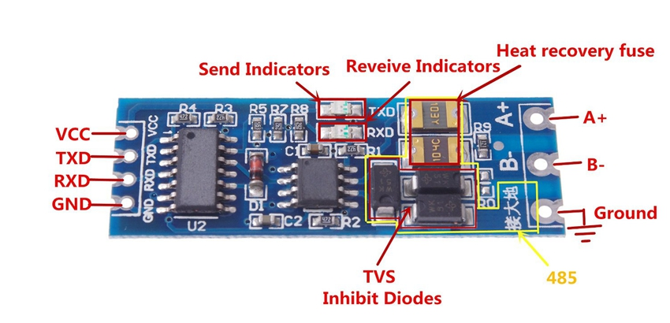

# EPEver MPPT charge controller Tracer RS485 Modbus LoRa

### An `Arduino - Platformio` project to connect the `EPSolar / EPEver` `Tracer A/B`, `Xtra`, `Triron` Series MPPT Solar Controllers (RS-485 Modbus) to a `Heltec ESP32 LoRa V2` and transmit the Readings to [TTN](https://www.thethingsnetwork.org/) also known as [The Things Network / The Things Stack](https://www.thethingsnetwork.org/).

This project is inspired by [Tracer-RS485-Modbus-Blynk V2.0 - RELOADED](https://github.com/tekk/Tracer-RS485-Modbus-Blynk-V2) and uses [LMIC-node](https://github.com/lnlp/LMIC-node) to quickly get the node up and running.


## Features
- Payload Formatter for TTN included


## Hardware


* [EPSolar/EPEver Tracer A/B-Series](https://www.aliexpress.com/wholesale?catId=0&initiative_id=SB_20170114172728&SearchText=tracer+mppt+rs485)
* [RS485 UART Module](https://www.aliexpress.com/wholesale?catId=0&initiative_id=SB_20170114172807&SearchText=uart+rs485)
* [Heltec ESP32 LoRa V2](https://www.aliexpress.com/wholesale?catId=0&initiative_id=AS_20220116081713&SearchText=heltec+wifi+lora+32+v2)
* [Ethernet Cable with 90° angeled plug for "Triron"](https://www.aliexpress.com/wholesale?catId=0&initiative_id=SB_20220116082844&origin=y&SearchText=Ethernet+Patch+Cord+90+Degree+Right+Angle)
or [Standard Ethernet Cable for other models](https://www.aliexpress.com/wholesale?catId=0&initiative_id=SB_20220116083244&SearchText=Ethernet+Patch+Cord)

## Software
* [Visual Studio Code](https://code.visualstudio.com/) with [Platformio.org](https://platformio.org/install/ide?install=vscode) extension
* The project sketch

## Wiring
Cut open your ethernet cable and split out pins `3, 5, 7 -> (B, A, GND)`. Refer to the [Tracer A/B Series MPPT Solar Controller - Modbus RTU Protocol](doc/MODBUS-Protocol-v25.pdf).
> :warning: **Do not use the Vcc pins (+5v or +7.5v) (pins `1 and 2`), or the controller may be damaged permanently.**: Be very careful here!

## Tutorial
### Rename the file `keyfiles\lorawan-keys_example.h` and save it as `keyfiles\lorawan-keys.h`
### Edit the file `keyfiles\lorawan-keys.h` and insert your Settings for TTN.
Example:
```cpp
// Optional: If DEVICEID is defined it will be used instead of the default defined in the BSF.
// #define DEVICEID "<deviceid>"

// Keys required for OTAA activation:

// End-device Identifier (u1_t[8]) in lsb format
#define OTAA_DEVEUI 0x00, 0x00, 0x00, 0x00, 0x00, 0x00, 0x00, 0x00

// Application Identifier (u1_t[8]) in lsb format
#define OTAA_APPEUI 0x00, 0x00, 0x00, 0x00, 0x00, 0x00, 0x00, 0x00

// Application Key (u1_t[16]) in msb format
#define OTAA_APPKEY 0x00, 0x00, 0x00, 0x00, 0x00, 0x00, 0x00, 0x00, 0x00, 0x00, 0x00, 0x00, 0x00, 0x00, 0x00, 0x00


// -----------------------------------------------------------------------------

// Optional: If ABP_DEVICEID is defined it will be used for ABP instead of the default defined in the BSF.
// #define ABP_DEVICEID "<deviceid>"

// Keys required for ABP activation:

// End-device Address (u4_t) in uint32_t format. 
// Note: The value must start with 0x (current version of TTN Console does not provide this).
#define ABP_DEVADDR 0x00000000

// Network Session Key (u1_t[16]) in msb format
#define ABP_NWKSKEY 0x00, 0x00, 0x00, 0x00, 0x00, 0x00, 0x00, 0x00, 0x00, 0x00, 0x00, 0x00, 0x00, 0x00, 0x00, 0x00

// Application Session K (u1_t[16]) in msb format
#define ABP_APPSKEY 0x00, 0x00, 0x00, 0x00, 0x00, 0x00, 0x00, 0x00, 0x00, 0x00, 0x00, 0x00, 0x00, 0x00, 0x00, 0x00

```

### Build the code with VS Code and upload it to the `Heltec ESP32 LoRa V2` dev-board.
### Wire the things up and plug it to the `EPSolar / EPEver Solar Charger`

## Reference
* [Tracer A/B Series MPPT Solar Controller - Modbus RTU Protocol](doc/MODBUS-Protocol-v25.pdf)
* UART RS485 module:



I'm using this cheapo module and it works quite fine.
It's powered from `+5V` from Heltec ESP32 LoRa V2, and wired as following:

- MAX485 module <-> Heltec ESP32 LoRa V2
	- `TXD` -> `23` / `GPIO23` / `TX`
	- `RXD` -> `22` / `GPIO22` / `RX`
	- `VCC` to `+5V` / `VIN` on Heltec ESP32 LoRa V2


- Tracer A/B MPPT Controller Ethernet cable <-> MAX485
	- Ethernet green, pin `5` -> `A`
	- Ethernet blue, pin `3` -> `B`
	- Ethernet brown, pin `7` -> `GND` on module **and** Heltec ESP32 LoRa V2 `GND` pin
		- -> to prevent ground loops - **important!**


## Project Status
Project is: _in progress_

Connection to MPPT Charge Controller is untested. 
